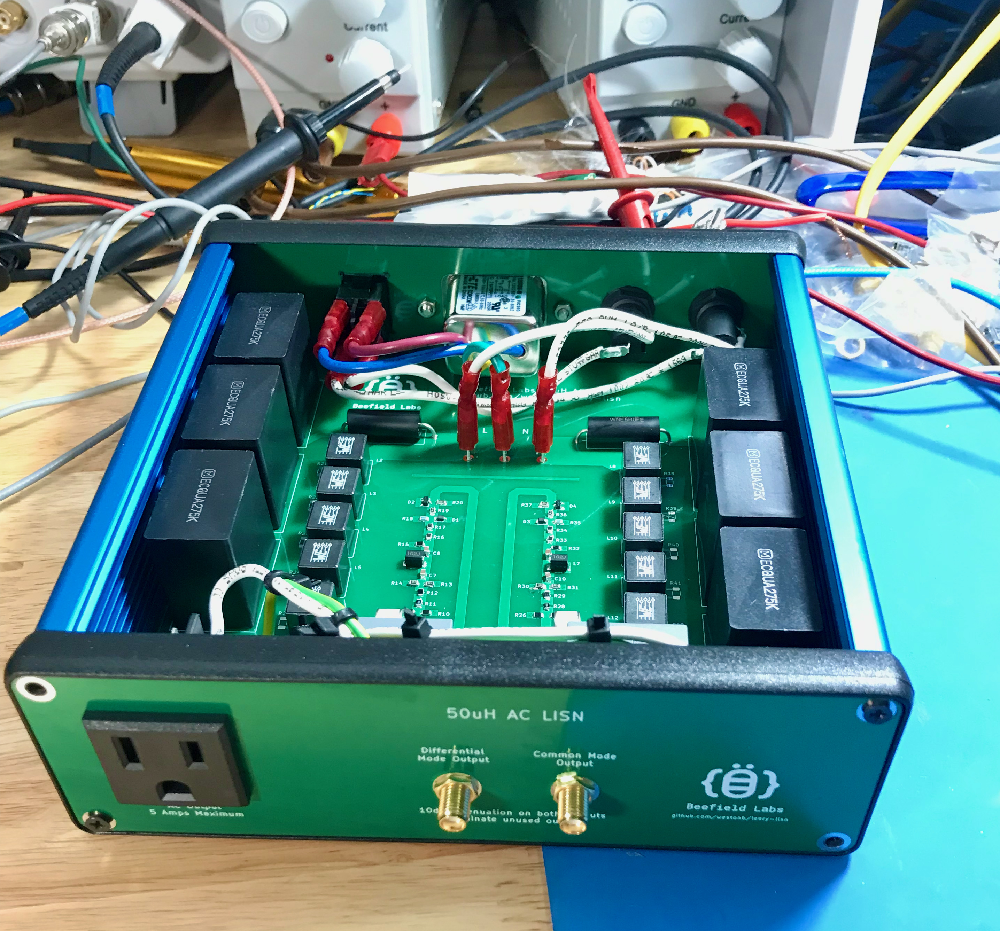
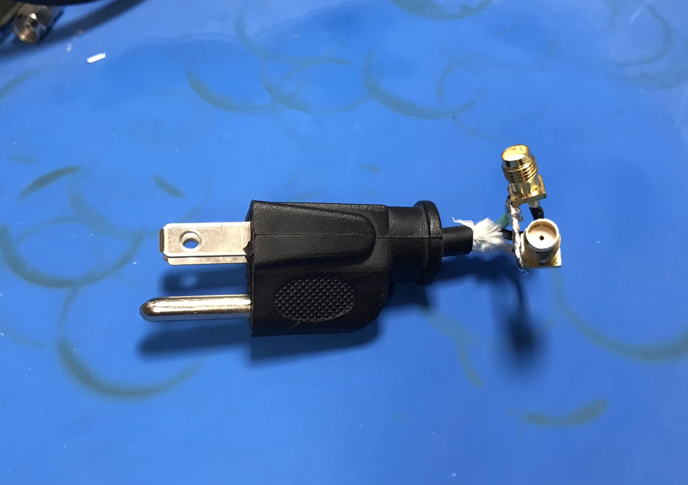
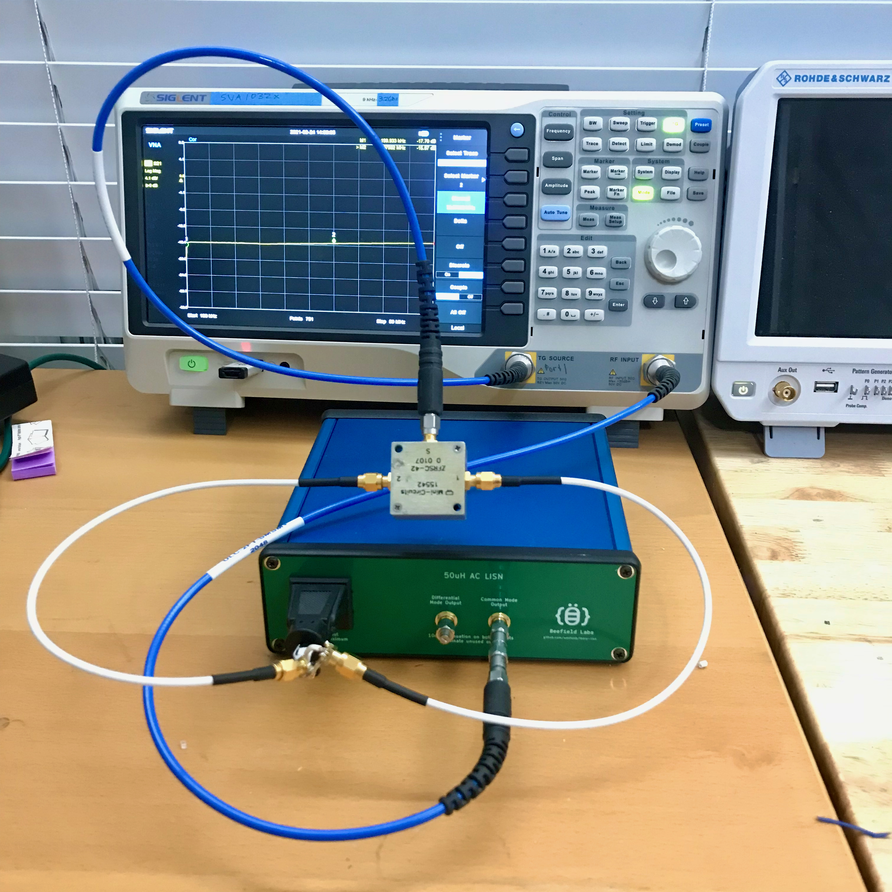
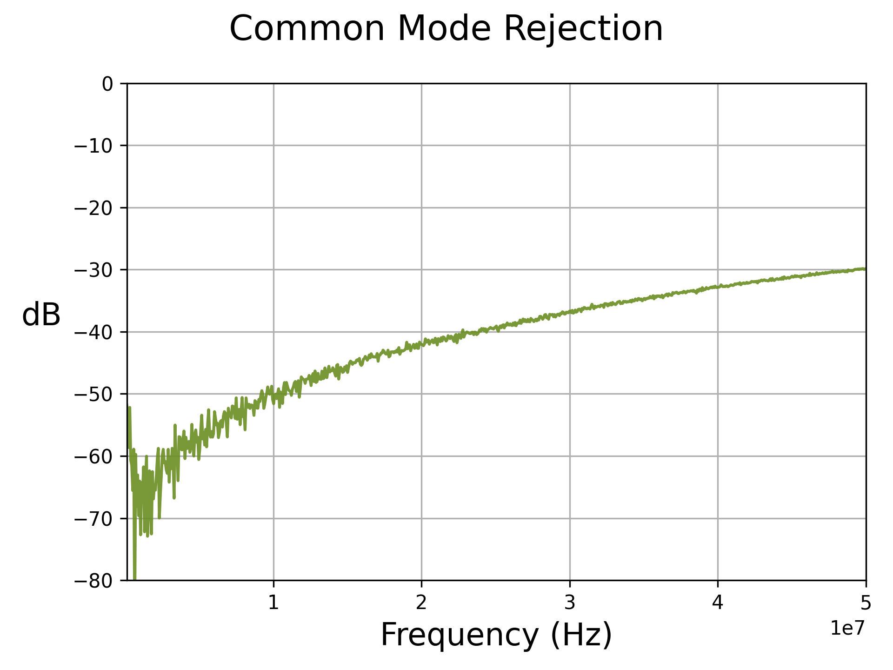
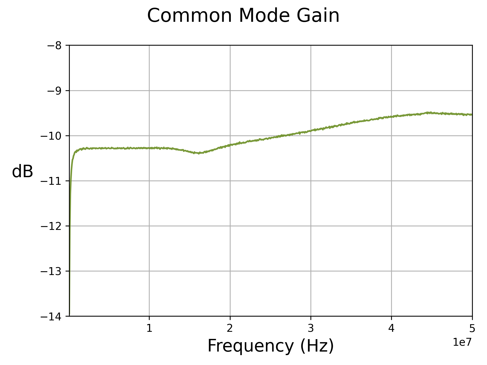
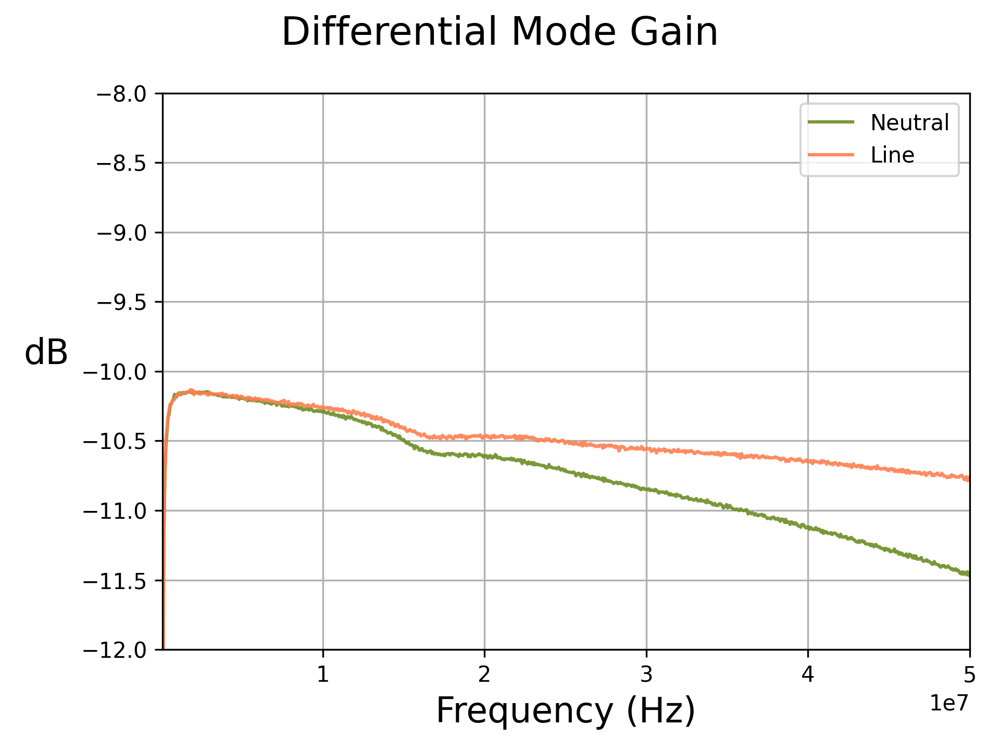
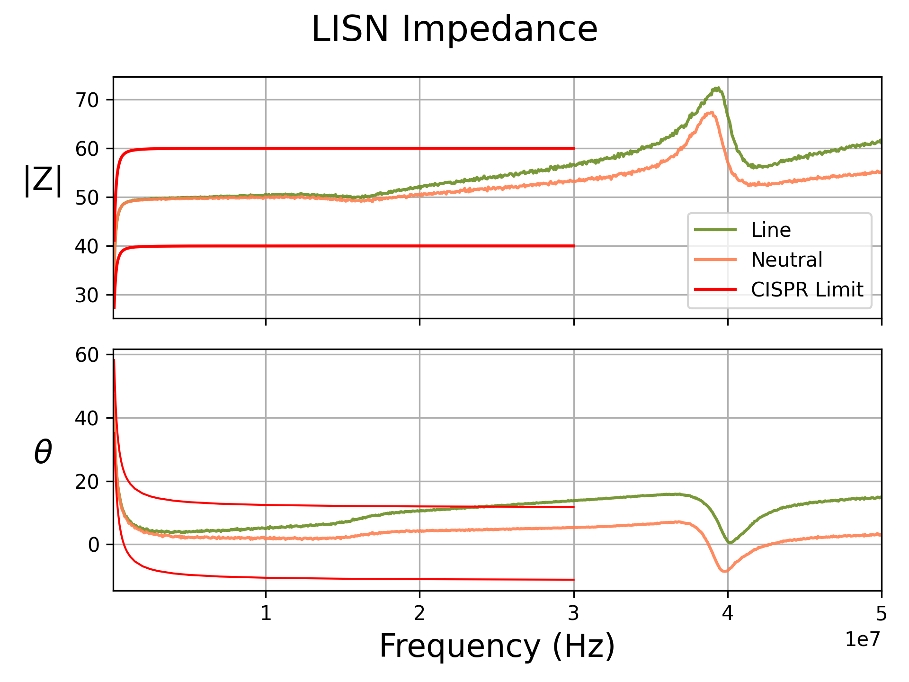

# leery-lisn
### A open source dual AC LISN with integrated common mode / differential mode separator and transient limiter.

**Schematic [here](doc/lisn-pcb.pdf)**

## Summary
The leery-lisn is a Line Impedance Stabilization Network (LISN) for pre-compliance conducted EMI measurements of devices that plug into the AC line.
A LISN goes between a device and the AC outlet and provides a known AC line impedance, allowing for repeatable measurements of conducted noise generated by the device.
It also contains circuitry to couple the noise to a 50 ohm RF output to allow for measurement with a spectrum analyzer.

The leery-lisn contains a LISN network on both the neutral and line connections of the AC plug and a common mode / differential mode separator, allowing for measurement of both the differential mode and common mode noise generated by a device.
It also contains a transient limiter to protect a connected spectrum analyzer from transients on the AC line or plugging the LISN into the AC line when the spectrum analyzer is already connected.

The design of the leery-lisn is loosely based on the LISN designs from this [thread](https://www.eevblog.com/forum/projects/5uh-lisn-for-spectrum-analyzer-emcemi-work/) on the EEVBlog forum, as well as the designs for a [common mode / differential mode separator](https://www.eevblog.com/forum/projects/diy-dm-cm-seperator-for-emc-lisn-mate/) and this [transient limiter](https://www.eevblog.com/forum/projects/transient-limiter-for-spectrum-analyzer-protection/).

## Specifications & Operation
The leery-lisn is a 50uH LISN, which is the typical impedance value for conducted emissions testing between 150KHz - 30MHz, as specified in standards such as CISPR16.
The leery-lisn is designed for a maximum input / output voltage of 240V, although the output plug is fixed as a US style 120V plug.
The current rating is 5A RMS.

Due to the transient limiter, the common mode and differential mode outputs have 10dB of attenuation.
For proper separation of the common mode and differential mode signals the unused output should be attenuated into 50 ohms.

The leery-lisn contains 8.1uF of capacitance between each AC leg and ground to decouple the LISN impedance from the impedance of the AC line.
Due to the high ground currents resulting from this capacitance, consider using a isolation transformer between the AC line and the leery-lisn.

## Performance
S21 measurements were taken of the leery-lisn to verify correct operation of the common mode / differential mode separator and impedance measurements were taken to check compliance with CISPR16 standard.

A very cursed adaptor was created to connect the AC output of the LISN to a VNA and measurements were taken with the AC input to the VNA shorted.

The leery-lisn is a three port device, so it can not be fully characterized with a two port VNA.
However, a resistive splitter allows for accurately measuring the common mode S21 and the common mode rejection.

 

If it is assumed that driving one input to the LISN with the other terminated into 50 ohms provides a even split of common mode and differential mode stimulus, the differential mode S21 can also be measured.

The impedance of the two legs can also be compared against the CISPR16 standard, which provides a table of frequency vs the allowable |Z| and phase of the LISN input impedance.
From the plot below it can be seen that the line leg of the LISN is slightly out of spec above 25MHz due to an extra 2" of wire running between the AC connector and the PCB.
This is also the cause of the difference in the differential mode response for the two inputs of the LISN.
leery-lisn technically does not meet the CISPR16 requirements, but should be close enough for pre-compliance work.

## Construction
The leery-lisn is completely open source and the PCB design for the LISN and the front and back panels are provided in this repository.

Parts not on the BOM for the PCB are:

| Description  | Quantity | Part Number     |
|--------------|----------|-----------------|
| Enclosure    | 1        | 1455T1601BU     |
| Fuse Holder  | 2        | 696211001102    |
| AC Outlet    | 1        | 3-119-052       |
| Power Switch | 1        | H8550VBBBEN551W |
| AC Inlet     | 1        | 1-6609987-4     |

## Improvements
A bleeder resistor should be added across the input capacitors to discharge them.

The impedance of the line side of the LISN is slightly outside of the limits specified in the CISPR16 standards due to the added wire length between the AC plug on the left side of the panel and the line input on the PCB, which is on the right.
The front panel could be redone to reduce this wire length.
